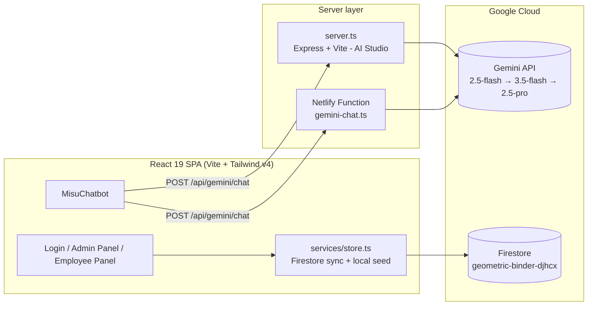

<div align="center">

# 🎬 MS2 Project Tracker

### Premium Cinematic Project Management Command Center for MS2 Entertainment & Production Studios

[](https://ms2-project-tracker.netlify.app)
[](https://ms2-project-tracker.ai.studio/)
[](https://react.dev)
[](https://vitejs.dev)
[](https://tailwindcss.com)
[](https://firebase.google.com)
[](https://aistudio.google.com)
[](LICENSE)

**Track projects. Command deadlines. Ship cinematic work — from one mission-control dashboard.**

*Developed by **Abhishek Goswami***

</div>

---

## ✨ Features

| Area | What it does |
|---|---|
| 🖥️ **Admin Command Panel** | Full studio overview — projects, employees, daily logs, activity audit, admin private notes |
| 👤 **Employee Panel** | Personal workspace — assigned projects, daily progress submissions, countdown metrics |
| 📊 **Cinematic Dashboards** | Recharts analytics, 3D calendar heatmap, deadline timeline, risk radar, production pipeline |
| 🤖 **MS2 AI Chatbot** | Server-side Gemini assistant that answers questions from the *live* studio database |
| ⌨️ **Command Palette** | Keyboard-first navigation across the entire app |
| 📝 **Report Builder + Weekly Summary** | One-shot studio reporting from real data |
| 🎞️ **GSAP Motion System** | Cinematic login + dashboard animations, studio/rest motion modes |
| 🌗 **Dark / Light Themes** | Full theme control across every surface |
| 🔥 **Firebase Backend** | Firestore real-time sync, offline persistence, security rules |
| 📱 **Fully Responsive** | Command-center experience on desktop and mobile |

---

## 🏗️ Architecture



- **AI Studio hosting** runs the full-stack Express server (`server.ts`).
- **Netlify hosting** serves the static Vite build and routes `/api/*` to the `gemini-chat` serverless function — identical chatbot behavior, zero client changes.

---

## 🚀 Run Locally

**Prerequisites:** Node.js 20+

```bash
# 1. Install dependencies
npm install

# 2. Configure secrets
cp .env.example .env
# → put your Gemini API key in GEMINI_API_KEY

# 3. Start the full-stack dev server (Express + Vite)
npm run dev
```

Open http://localhost:3000

**Demo credentials** (seeded):

| Role | Username | Password |
|---|---|---|
| Admin | `Ratan` | `RatanMs2Admin` |
| Employee | `Madhur` / `Abhishek` / `Krishna` | their Employee ID (e.g. `MS2-EMP-465`) |

---

## ☁️ Deploy on Netlify

1. Push this repo to GitHub and connect it in Netlify (**Add new site → Import an existing project**).
2. Build settings (already in `netlify.toml`):
   - **Build command:** `npm run build:client`
   - **Publish directory:** `dist`
   - **Functions directory:** `netlify/functions`
3. Add environment variable: `GEMINI_API_KEY` → your Gemini API key.
4. Deploy. The chatbot endpoint `/api/gemini/chat` is served by the bundled serverless function automatically.

> Firebase: the app ships pointed at the live MS2 Firestore project. To use a different project, set the `VITE_FIREBASE_*` variables (see `.env.example`) and whitelist your Netlify domain under Firebase Console → Authentication → Authorized domains.

---

## 🔐 Environment Variables

| Variable | Scope | Required | Purpose |
|---|---|---|---|
| `GEMINI_API_KEY` | server | ✅ | MS2 AI chatbot (Netlify Function / Express) |
| `APP_URL` | server | – | Public app URL for self-referential links |
| `VITE_FIREBASE_*` | client | – | Override Firebase project (defaults ship with the live MS2 project) |

See [`.env.example`](.env.example) for the full list.

---

## 📁 Project Structure

```
├── netlify/
│   └── functions/gemini-chat.ts   # Serverless MS2 AI chatbot (port of server.ts)
├── netlify.toml                   # Build, SPA redirects, /api/* → functions
├── server.ts                      # Full-stack Express server (AI Studio hosting)
├── src/
│   ├── App.tsx                    # Login + shell, theme & mode control
│   ├── components/                # AdminPanel, EmployeePanel, charts, 3D views,
│   │                              # CommandPalette, MisuChatbot, ReportBuilder…
│   ├── services/
│   │   ├── firebase.ts            # Firebase init (env-overridable config)
│   │   └── store.ts               # Data layer: Firestore sync + seed data
│   ├── hooks/                     # GSAP login/dashboard animation hooks
│   └── types.ts                   # Domain models
├── firestore.rules                # Firestore security rules
├── firebase-blueprint.json        # Firebase schema blueprint
└── index.html
```

---

## 🧪 Quality Gates

- `npm run lint` — TypeScript strict check passes clean
- `npm run build:client` — production Netlify build passes
- Screen-by-screen parity verified against the AI Studio live build: login, admin dashboard, employee panel, charts, heatmap, chatbot, animations, themes, responsive layouts — zero console errors

---

## 📄 License

Apache-2.0 — see [LICENSE](LICENSE).

<div align="center">

**MS2 Project Tracker** • Developed by **Abhishek Goswami**

</div>
